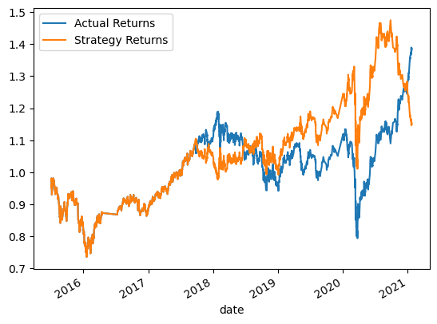

# Module-14-Challenge
algo trading

## Evaluation Report
In this exercise, we look to examine algorithmic trading. 

In this exercise we do the following:
1) we use we look at the Support Vector Machines. 
2) we Tune the SVM algoritm
3) Then we look at a different machine learning classifier in this case, a Logistic Regression
---------- 
### Baseline SVM 

Short window =4  
Long window =100  
Training window = 3   

)

Adjusting SAM windows
adjusting the SAM short windows from 4-6 caused the model to start overfitting the data. The precision goes to 1 for the buy signal, but the sell signal goes to 0. The result is the same as a buy-and-hold strategy. 

Reducing the long window down helped improve the return towards the end of the evaluation window. 

Changing the training time created similar results in the end but created situations where there were losses. 

---------- 
### Tuned

I settled on  the following parameters:   
short window =4  
long window =30  
training window =6  

---------- 
### Logistic Regression
using the base parameters 
short window =4
long window =100
training window = 3

I created a logistic regression. This resulted in the following returns:

-----
### Conclusion
it's hard to say which model is better. The results can be wildly different depending on the training time, SMA window, or even model type. If I'm only evaluating my returns at the end of the analysis period, then the tuned model regression do well to give you a positive return and one that outperforms the buy-and-hold strategy. However, there are periods when each strategy outpreforms and then underperforms. Ultimately, none of these models do better than a coin-flip. 